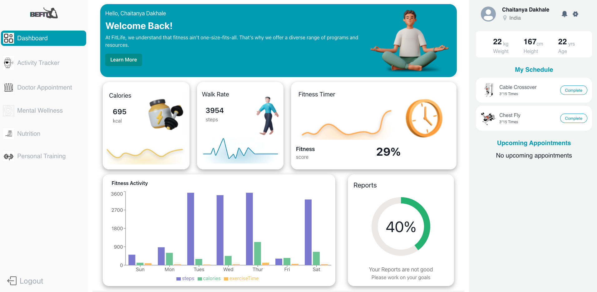

# Baidu-Bandits_072

The Health and Wellness Project is a comprehensive application designed to promote a healthier lifestyle by integrating physical activity tracking, medical appointments, mental health support, and exercise scheduling. This project aims to provide users with a holistic approach to their health and wellness, leveraging modern technology to facilitate healthier habits and improved well-being.


## Deployed Link

https://be-1fit.netlify.app/


https://baidu-bandits-072-git-main-sanjukumari-techs-projects.vercel.app/


## Features

- Physical Activity Tracking : View detailed statistics and progress reports to stay motivated and track improvement over time.

- Doctor Appointment Booking : Book appointments with doctors directly through the application, with confirmation and reminder notifications.

- Nutrition  : Receive personalized suggestions on how to improve their physical health based on user's goal data.

- Mental Health Support : Receive personalized suggestions on how to improve your mental health based on your mood data.

- Exercise Scheduling Planning : Create and customize your exercise schedule to fit your lifestyle and preferences.


## Tech Stack

**Client:** Reactjs, Redux, Chakra UI

**Server:** Firebase

---
## Directory Structure

```plaintext
Baidu-Bandits/
├── public/
├── src/
│   ├── AllPages/
│   │   ├── admin/
│   │   │   ├── AdminDashboard.jsx
│   │   │   ├── AdminNavbar.jsx
│   │   │   ├── UserModal.jsx
│   │   │   ├── adminstyles.css
│   │   ├── ActivityTracker.jsx
│   │   ├── AllRoutes.jsx
│   │   ├── Auth.jsx
│   │   ├── Dashboard.jsx
│   │   ├── DoctorAppointment.jsx
│   │   ├── ExerciseRecommendation.jsx
│   │   ├── Home.jsx
│   │   ├── MentalWellness.jsx
│   │   ├── Nutrition.jsx
│   │   ├── PersonalTraining.jsx
│   ├── assets/
|   │   ├── icons/
│   ├── auth/
│   ├── pageComponents/
|   │   ├── MentalWellnessComp.jsx
|   │   ├── NutritionComp.jsx
│   ├── redux/
|   │   ├── actionTypes.js
|   │   ├── reducer.js
|   │   ├── store.js
│   ├── styles/
│   │   ├── mentalWellness.css
│   ├── App.css
│   ├── App.jsx
│   ├── main.jsx
│   ├── index.css
├── index.html/
```


## How to use

To deploy this project run

```
  git clone https://github.com/sanjukumari-tech/Baidu-Bandits_072.git
```

````
npm install
npm i firebase
npm i redux react-redux
npm i @chakra-ui/react @emotion/react @emotion/styled framer-motion

npm run dev
````
## Screenshots




## Authors

- [Mahesh S R](https://github.com/mahesh06111999)
- [Sanju Kumari](https://github.com/sanjukumari-tech)
- [Subhankar Banik](https://github.com/subhankarbanik)
- [Chaitanya Dakhale](https://github.com/Chaitanya-05)

